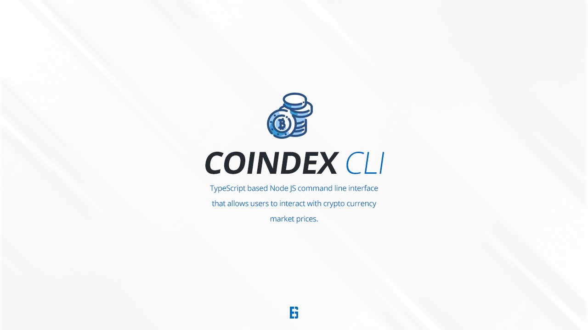

https://img.shields.io/github/languages/code-size/EadsGraphic/nodejs-cli

#### Installation

> Get API key from [Nomics Crypto Data](https://docs.nomics.com/)

Install all NodeJs and all package dependencies prior to running project.

```node
npm install
```

Link the current project directory to your computer to enable running project from command line interface.

```node
npm link
```

#### Usage

Show all CLI commands and options

```node
coindex - h;
```

Get the current CLI version number

```node
coindex - V;
```

Set critical CLI environment variables

```node
coindex key set
coindex key show
coindex key remove
```

```node
coindex check price
```

```node
coindex check --coin=BTC,ETH
```

```node
coindex check --cur=EUR
```

#### Contributing

Pull requests are welcome. For major changes, please open an issue first to discuss what you would like to change.

Please make sure to update tests as appropriate.

#### License

[MIT](https://choosealicense.com/licenses/mit/)
